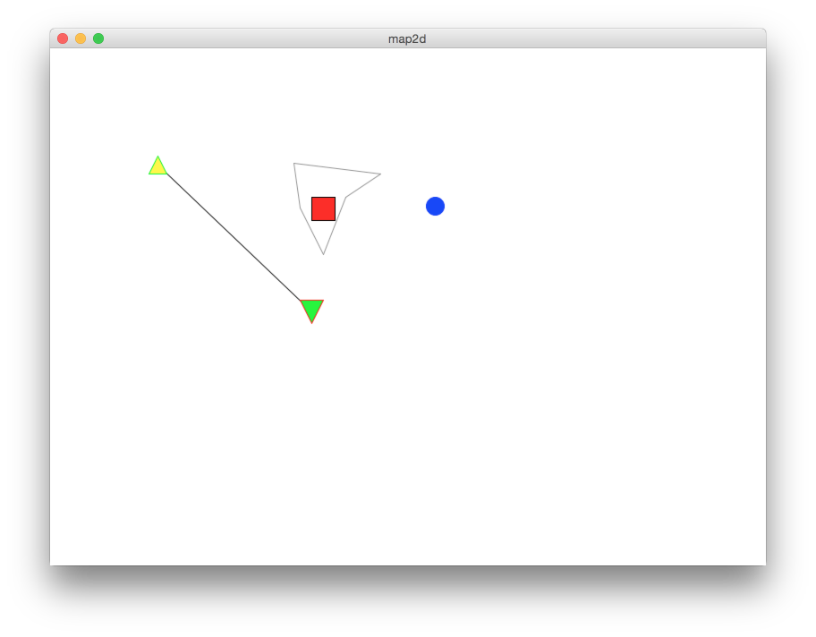

# map2d
Simple 2-D rendering tool to visualize graph-based algorithms

# Overview
This is an application I created on weekend to improve debugging process at my fulltime work. In [Magenta Technology](http://magenta-technology.com/)
I worked on [Vehicle Routing Problem](https://en.wikipedia.org/wiki/Vehicle_routing_problem) and other related taks
and it was painful to debug a local search optimization algorithm or a constructive algorithm looking into raw graphs 
or matrix data structures. So, I created a step-by-step visualization tool which draws basic shapes and polyline, 
allows zoom and drag them:

The live UI can be seen [here](https://youtu.be/KSNDeEb8qlE) (youtube)

The result animation of a well-known VRP algorithm is [here](https://youtu.be/y3d2hpnllVg) (youtube). Obviously I cannot 
share any proprietary implementation.
